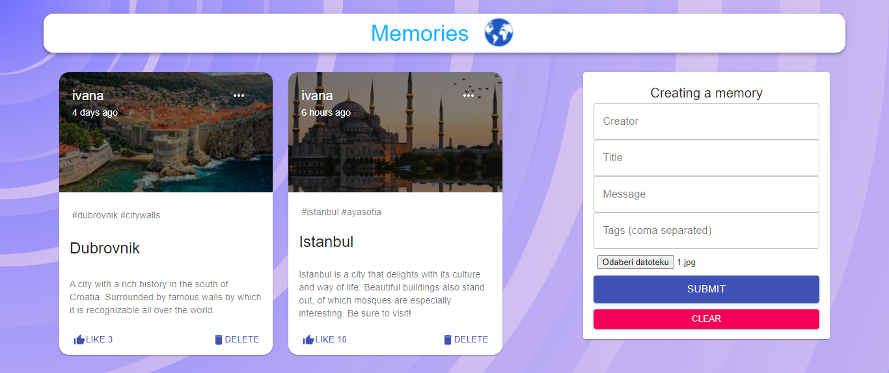

# mern_memories

## General info
* The application was created using [this tutorial](https://www.youtube.com/watch?v=ngc9gnGgUdA). 
* The data entered in the form are saved in the database and displayed as a post. 
* Full-stack application
* Edit, like and delete posts

## Technologies
* MERN

 
 

## Deployment

 [Click here]() for backend(https://city-posts.herokuapp.com/)

 [Click here]() for backend(mern-memories2.netlify.app)
